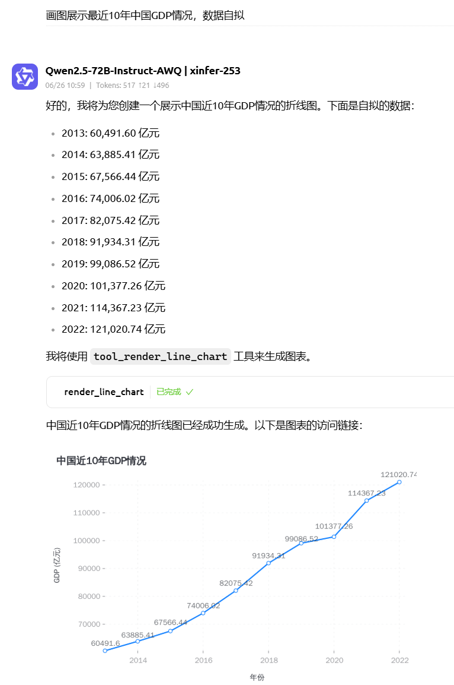
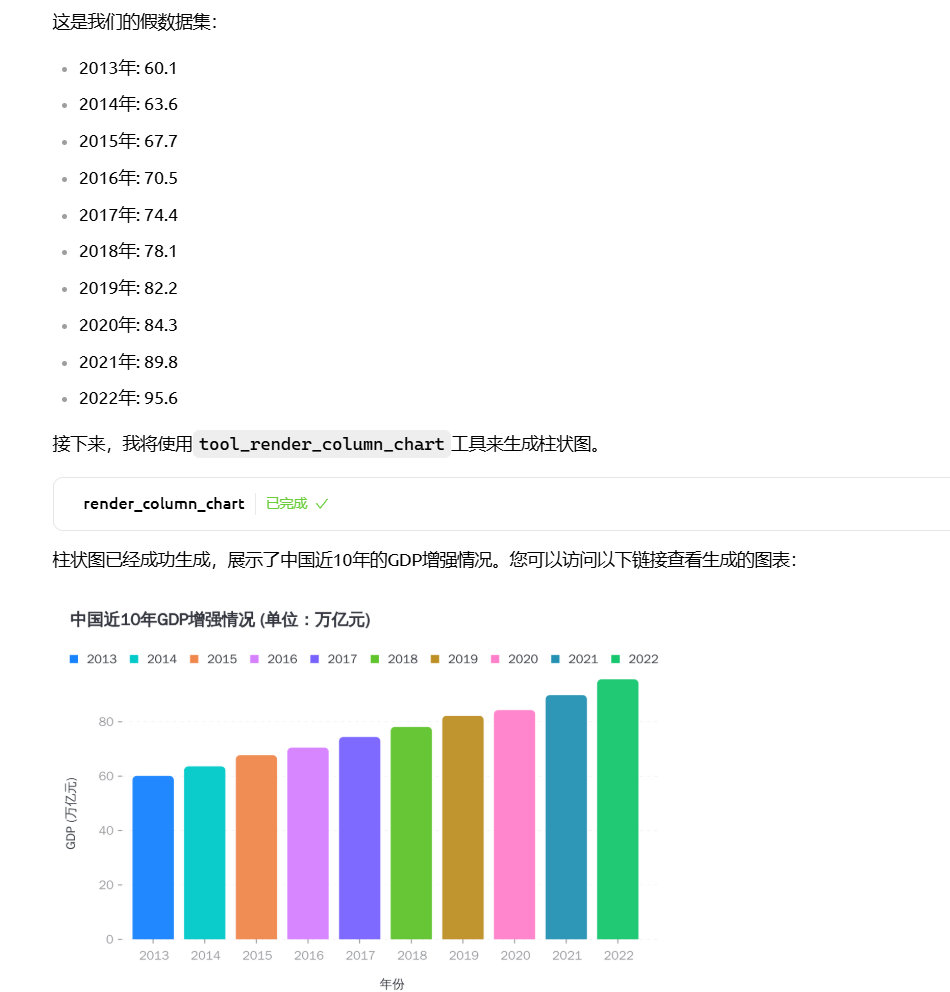
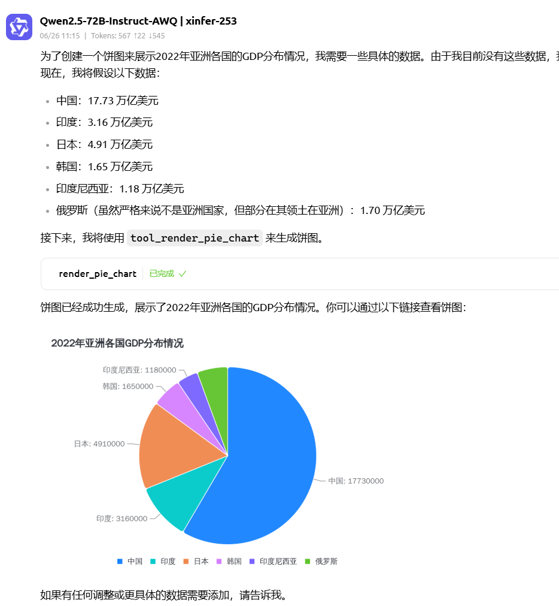

# AntVis MCP SSE - 专业图表渲染服务器

这是一个基于 Model Context Protocol (MCP) 的**专业图表渲染服务器**，支持 8 种图表类型，具备外部访问能力、性能优化和Docker容器化部署。

## ✨ 核心特性

- 🎯 **8种专用图表工具** - 线图、柱图、条图、饼图、面积图、散点图、双轴图、直方图
- 🌐 **外部访问支持** - 可配置主机名/IP，支持跨机器访问
- ⚡ **性能优化** - 图表缓存、异步渲染、时间监控
- 🐳 **一键部署** - 简化的Docker Compose部署，所有配置集中管理
- 📊 **HTTP URL访问** - 生成可直接访问的图片URL
- 🔒 **企业级安全** - 非root用户运行，安全沙箱
- 📈 **实时监控** - SSE连接状态、性能指标、健康检查


## 🚀 快速开始

### 一键部署（推荐）

```bash
# 1. 克隆项目
git clone <repository-url>
cd antvis-mcp-sse

# 2. 修改外部访问IP（编辑docker-compose.yml中的HOST值）
# 将 HOST=192.168.10.187 改为您的实际IP地址

# 3. 构建并启动服务
docker build -t antvis-mcp-sse:latest .
docker compose up -d

# 4. 验证服务
# HTTPS访问（推荐）
curl -k https://YOUR_IP:8443/health

# 或HTTP访问
curl http://YOUR_IP:8000/health
```

### 本地开发

```bash
# 1. 安装依赖
npm install

# 2. 设置环境变量并启动
export HOST=YOUR_IP        # 替换为您的实际IP
export HTTP_PORT=8000      # HTTP端口
export HTTPS_PORT=8443     # HTTPS端口
export ENABLE_HTTPS=true   # 启用HTTPS
export ENABLE_HTTP=true    # 启用HTTP
npm start
```

## 📊 MCP 工具列表

| 工具名称 | 图表类型 | 适用场景 |
|---------|---------|---------| 
| `render_line_chart` | 线图 | 趋势分析、时间序列数据 |
| `render_column_chart` | 柱图 | 分类数据比较、排名分析 |
| `render_bar_chart` | 条图 | 水平对比、长标签数据 |
| `render_pie_chart` | 饼图 | 占比分析、构成分析 |
| `render_area_chart` | 面积图 | 累积数据、趋势填充 |
| `render_scatter_chart` | 散点图 | 相关性分析、分布研究 |
| `render_dual_axes_chart` | 双轴图 | 不同量级数据对比 |
| `render_histogram_chart` | 直方图 | 数据分布、频率分析 |

每个工具都支持：
- ✅ 完整的数据验证和错误处理
- ✅ 丰富的样式定制选项
- ✅ 缓存机制提升性能
- ✅ 返回可外部访问的HTTP URL

### 图表渲染示例

以下是主要图表类型的渲染效果：

| 图表类型 | 渲染效果 | 特点说明 |
|---------|---------|----------|
| **线图** |  | 清晰展示趋势变化，支持多条线对比 |
| **柱图** |  | 直观对比数据大小，支持分组和堆叠 |
| **饼图** |  | 展示占比关系，支持环形图样式 |

## ⚙️ 配置说明

### 环境变量配置

所有配置都在 `docker-compose.yml` 中集中管理：

```yaml
environment:
  - HTTP_PORT=8000               # HTTP服务端口
  - HTTPS_PORT=8443              # HTTPS服务端口
  - ENDPOINT=/message            # SSE端点路径  
  - NODE_ENV=production          # 运行环境
  - HOST=192.168.10.187         # 外部访问主机（修改为您的实际IP）
  - ENABLE_HTTPS=true           # 启用HTTPS服务器
  - ENABLE_HTTP=true            # 启用HTTP服务器
  - LOG_LEVEL=info              # 日志级别（可选：debug, info, warn, error）
  - IMAGES_DIR=/app/images      # 容器内图片存储目录
  - MAX_IMAGE_SIZE=10           # 最大图片大小限制(MB)
  # SSL证书配置（可选）
  # - SSL_KEY_PATH=/app/ssl/external.key
  # - SSL_CERT_PATH=/app/ssl/external.crt
```

### 🔒 HTTPS完整支持

**双端口监听：**
- **HTTP端口**：8000（避免特权端口权限问题）
- **HTTPS端口**：8443（避免特权端口权限问题） 
- **自动SSL证书**：支持自签名证书生成
- **外部证书**：支持挂载外部SSL证书

**端口选择说明：**
- 使用8000/8443端口避免需要root权限绑定80/443特权端口
- 便于在开发和生产环境中灵活部署
- 减少与系统服务的端口冲突

**服务器配置选项：**

1. **双协议模式（推荐）**：
```yaml
# 同时支持HTTP和HTTPS访问
environment:
  - ENABLE_HTTP=true
  - ENABLE_HTTPS=true
  - HOST=your-domain.com
```

2. **仅HTTPS模式**：
```yaml
# 仅启用HTTPS，更安全
environment:
  - ENABLE_HTTP=false
  - ENABLE_HTTPS=true
```

3. **仅HTTP模式**：
```yaml
# 仅启用HTTP，适合内网或开发环境
environment:
  - ENABLE_HTTP=true
  - ENABLE_HTTPS=false
```

4. **外部SSL证书**：
```yaml
# 使用自己的SSL证书
environment:
  - ENABLE_HTTPS=true
  - SSL_KEY_PATH=/app/ssl/your-domain.key
  - SSL_CERT_PATH=/app/ssl/your-domain.crt
volumes:
  - ./ssl:/app/ssl
```

### 修改外部访问地址

编辑 `docker-compose.yml` 文件，修改 `HOST` 环境变量：

```yaml
# 本机访问
- HOST=localhost

# 局域网访问
- HOST=192.168.1.100

# 公网访问（如果有公网IP或域名）
- HOST=your-domain.com
```

### 🔗 MCP 连接配置

配置MCP服务器时使用以下URL格式：

```
# HTTP连接（推荐）
http://YOUR_IP:8000/sse

# HTTPS连接
https://YOUR_IP:8443/sse
```

**注意事项：**
- 首次连接建议使用HTTP避免SSL证书问题
- 确保防火墙已开放对应端口
- HOST环境变量需与实际访问IP一致

## 📁 项目结构

```
antvis-mcp-sse/
├── server.js              # 主服务器代码
├── Dockerfile             # Docker构建配置
├── docker-compose.yml     # 容器编排配置
├── package.json           # 项目依赖
├── README.md              # 项目文档
├── .dockerignore          # Docker构建忽略
├── .gitignore             # Git忽略配置
└── images/                # 图片存储目录
```

## 🔧 工具使用示例

### 基础饼图

```json
{
  "name": "render_pie_chart",
  "arguments": {
    "title": "销售占比分析",
    "data": [
      {"category": "产品A", "value": 30},
      {"category": "产品B", "value": 25},
      {"category": "产品C", "value": 45}
    ],
    "config": {
      "angleField": "value",
      "colorField": "category"
    }
  }
}
```

**返回示例：**
```json
{
  "content": [
    {
      "type": "text",
      "text": "pie图表渲染成功！"
    },
    {
      "type": "text", 
      "text": "文件大小: 110KB"
    },
    {
      "type": "text",
      "text": "渲染耗时: 1250ms"
    },
    {
      "type": "text",
      "text": "访问链接: http://192.168.10.187:8000/images/pie_chart_1234567890.png"
    }
  ]
}
```

**双协议模式返回示例：**
```json
{
  "content": [
    {
      "type": "text",
      "text": "pie图表渲染成功！"
    },
    {
      "type": "text",
      "text": "文件大小: 110KB"
    },
    {
      "type": "text", 
      "text": "渲染耗时: 1250ms"
    },
    {
      "type": "text",
      "text": "HTTPS访问: https://192.168.10.187:8443/images/pie_chart_1234567890.png"
    },
    {
      "type": "text",
      "text": "HTTP访问: http://192.168.10.187:8000/images/pie_chart_1234567890.png"
    }
  ]
}
```

**URL访问格式说明：**
- **HTTPS（推荐）**: `https://YOUR_IP:8443/images/图片名.png`
- **HTTP**: `http://YOUR_IP:8000/images/图片名.png`

### 高级双轴图

```json
{
  "name": "render_dual_axes_chart",
  "arguments": {
    "title": "销售额与利润率对比",
    "data": [
      {"month": "1月", "sales": 1000, "profit_rate": 15},
      {"month": "2月", "sales": 1200, "profit_rate": 18}
    ],
    "config": {
      "xField": "month",
      "yField": ["sales", "profit_rate"],
      "geometryOptions": [
        {"geometry": "column", "color": "#5B8FF9"},
        {"geometry": "line", "color": "#5AD8A6"}
      ]
    }
  }
}
```

## 📈 性能特性

### 智能缓存系统
- 基于配置哈希的图表缓存
- 最大缓存100个图表，自动清理
- 缓存命中可减少90%的渲染时间

### 异步渲染引擎
- 非阻塞图表生成
- 并发处理多个渲染请求
- 实时性能监控和日志

### 监控指标
- 渲染时间统计
- 缓存命中率
- SSE连接状态
- 系统资源使用

## 🐳 Docker 部署

### 构建镜像

```bash
# 标准构建
docker build -t antvis-chart-sse:latest .

# 无缓存构建
docker build --no-cache -t antvis-chart-sse:latest .
```

### 容器管理

```bash
# 启动服务
docker compose up -d

# 查看日志
docker compose logs -f antvis-mcp

# 停止服务
docker compose down

# 重启服务
docker compose restart
```

### 健康检查

容器自带健康检查，访问 `/health` 端点：

```bash
# HTTPS访问（推荐）
curl -k https://YOUR_IP:8443/health

# HTTP访问  
curl http://YOUR_IP:8000/health

# 预期返回: {"status":"ok","timestamp":"2024-12-25T10:30:00.000Z"}
```

## 🛠️ 故障排除

### 常见问题

**1. 图片URL无法访问**
```bash
# 检查HOST环境变量设置
docker compose exec antvis-mcp env | grep HOST

# 确认防火墙端口开放
sudo ufw allow 8000   # HTTP端口
sudo ufw allow 8443   # HTTPS端口

# 验证服务状态
curl -k https://YOUR_IP:8443/health   # HTTPS
curl http://YOUR_IP:8000/health       # HTTP
```

**2. 容器启动失败**
```bash
# 查看详细日志
docker compose logs antvis-mcp

# 检查端口占用
netstat -tulpn | grep 8000    # HTTP端口
netstat -tulpn | grep 8443    # HTTPS端口

# 检查容器状态
docker compose ps
```

**3. 图表渲染缓慢**
```bash
# 查看缓存命中率
docker compose logs antvis-mcp | grep "缓存"

# 监控容器资源
docker stats antvis-mcp
```

**4. SSE连接频繁断开**
```bash
# 这是正常现象，IDE会自动重连
# 可通过日志级别控制详细程度
# 在docker-compose.yml中设置: LOG_LEVEL=warn
```

**5. Docker Compose相关问题**
```bash
# 检查compose文件语法
docker compose config

# 验证compose文件并显示最终配置
docker compose config --services

# 重新构建并启动（强制重建）
docker compose up -d --build

# 完全清理并重启
docker compose down -v
docker compose up -d

# 查看所有容器状态
docker compose ps -a

# 查看特定服务的详细信息
docker compose logs antvis-mcp --tail 50
```

**6. 混合内容问题（HTTPS环境）**
```bash
# 问题现象：HTTPS页面无法加载HTTP图片
# 解决方案1：使用相对协议URL（推荐）
# 在浏览器控制台检查是否有混合内容错误

# 解决方案2：配置HTTPS协议
# 修改docker-compose.yml中的PROTOCOL=https

# 验证协议配置
docker compose exec antvis-mcp env | grep PROTOCOL
```

### 性能优化建议

**生产环境**
- 使用SSD存储提升图片写入速度
- 配置Nginx反向代理进行负载均衡
- 设置适当的容器资源限制
- 定期清理历史图片文件

**开发环境**
- 使用本地volume挂载加速开发
- 启用详细日志便于调试
- 配置热重载便于代码修改

## 📚 API 文档

### MCP 标准接口

本服务完全兼容 MCP (Model Context Protocol) 标准：

- **工具发现**: 自动注册8个图表渲染工具
- **参数验证**: 严格的JSON Schema验证
- **错误处理**: 标准化错误响应格式
- **SSE通信**: 实时双向通信支持

### 数据格式支持

**输入数据格式**
- JSON数组格式
- Chart.js兼容格式
- 自动数据类型转换

**输出格式**
- PNG图片文件
- 可配置图片质量
- HTTP可访问URL


## 📄 许可证

本项目采用 MIT 许可证 

---

**快速开始命令总结：**

```bash
# 完整部署流程
git clone <repository-url> && cd antvis-mcp-sse
# 编辑 docker-compose.yml 中的 HOST 为您的实际IP地址
docker build -t antvis-chart-sse:latest .
docker compose up -d
# 验证服务状态
curl http://YOUR_IP:7001/health
docker compose ps antvis-mcp
```

🎉 现在您可以通过MCP客户端使用8个强大的图表渲染工具了！ 