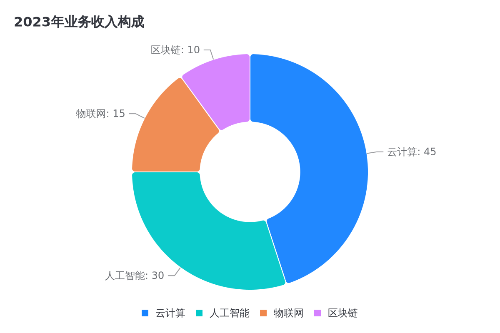

# AntVis MCP SSE - 专业图表渲染服务器

这是一个基于 Model Context Protocol (MCP) 的**专业图表渲染服务器**，支持 9 种图表类型，具备外部访问能力、性能优化和Docker容器化部署。


## ✨ 核心特性

- 🎯 **9种专用图表工具** - 线图、柱图、条图、饼图、面积图、散点图、双轴图、直方图、树状图
- 🌐 **外部访问支持** - 可配置主机名/IP，支持跨机器访问
- ⚡ **性能优化** - 图表缓存、异步渲染、时间监控
- 🐳 **一键部署** - 简化的Docker Compose部署，所有配置集中管理
- 📊 **HTTP URL访问** - 生成可直接访问的图片URL
- 🔒 **企业级安全** - 非root用户运行，安全沙箱
- 📈 **实时监控** - SSE连接状态、性能指标、健康检查

## 🎨 图表类型展示

以下是主要图表类型的渲染效果：

| 图表类型 | 渲染效果 | 特点说明 |
|---------|---------|----------|
| **线图** |  | 清晰展示趋势变化，支持多条线对比 |
| **柱图** |  | 直观对比数据大小，支持分组和堆叠 |
| **条图** |  | 水平对比，适合长标签数据 |
| **饼图** |  | 展示占比关系，支持环形图样式 |
| **面积图** |  | 展示累积数据趋势和填充效果 |
| **散点图** |  | 显示变量间相关性和数据分布 |
| **双轴图** |  | 对比不同量级的数据系列 |
| **直方图** |  | 显示数据分布和频率统计 |
| **树状图** |  | 层次数据占比可视化 |

## 🚀 快速开始

### 一键部署（推荐）

```bash
# 1. 克隆项目
git clone <repository-url>
cd antvis-mcp-sse

# 2. 修改外部访问IP（编辑docker-compose.yml中的HOST值）
# 将 HOST=192.168.10.187 改为您的实际IP地址

# 3. 构建并启动服务
docker build -t antvis-mcp-sse:latest .
docker compose up -d

# 4. 验证服务
# HTTPS访问（推荐）
curl -k https://YOUR_IP:8443/health

# 或HTTP访问
curl http://YOUR_IP:8000/health
```

### 本地开发

```bash
# 1. 安装依赖
npm install

# 2. 设置环境变量并启动
export HOST=YOUR_IP        # 替换为您的实际IP
export HTTP_PORT=8000      # HTTP端口
export HTTPS_PORT=8443     # HTTPS端口
export ENABLE_HTTPS=true   # 启用HTTPS
export ENABLE_HTTP=true    # 启用HTTP
npm start
```

## 📊 MCP 工具列表

| 工具名称 | 图表类型 | 适用场景 |
|---------|---------|---------| 
| `render_line_chart` | 线图 | 趋势分析、时间序列数据 |
| `render_column_chart` | 柱图 | 分类数据比较、排名分析 |
| `render_bar_chart` | 条图 | 水平对比、长标签数据 |
| `render_pie_chart` | 饼图 | 占比分析、构成分析 |
| `render_area_chart` | 面积图 | 累积数据、趋势填充 |
| `render_scatter_chart` | 散点图 | 相关性分析、分布研究 |
| `render_dual_axes_chart` | 双轴图 | 不同量级数据对比 |
| `render_histogram_chart` | 直方图 | 数据分布、频率分析 |
| `render_treemap_chart` | 树状图 | 层次数据占比、文件系统可视化 |

每个工具都支持：
- ✅ 完整的数据验证和错误处理
- ✅ 丰富的样式定制选项
- ✅ 缓存机制提升性能
- ✅ 返回可外部访问的HTTP URL

## ⚙️ 配置说明

### 环境变量配置

所有配置都在 `docker-compose.yml` 中集中管理：

```yaml
environment:
  - HTTP_PORT=8000               # HTTP服务端口
  - HTTPS_PORT=8443              # HTTPS服务端口
  - ENDPOINT=/message            # SSE端点路径  
  - NODE_ENV=production          # 运行环境
  - HOST=192.168.10.187         # 外部访问主机（修改为您的实际IP）
  - ENABLE_HTTPS=true           # 启用HTTPS服务器
  - ENABLE_HTTP=true            # 启用HTTP服务器
  - LOG_LEVEL=info              # 日志级别（可选：debug, info, warn, error）
  - IMAGES_DIR=/app/images      # 容器内图片存储目录
  - MAX_IMAGE_SIZE=10           # 最大图片大小限制(MB)
  # SSL证书配置（可选）
  # - SSL_KEY_PATH=/app/ssl/external.key
  # - SSL_CERT_PATH=/app/ssl/external.crt
```

### 🔒 HTTPS完整支持

**双端口监听：**
- **HTTP端口**：8000（避免特权端口权限问题）
- **HTTPS端口**：8443（避免特权端口权限问题） 
- **自动SSL证书**：支持自签名证书生成
- **外部证书**：支持挂载外部SSL证书

**端口选择说明：**
- 使用8000/8443端口避免需要root权限绑定80/443特权端口
- 便于在开发和生产环境中灵活部署
- 减少与系统服务的端口冲突

**服务器配置选项：**

1. **双协议模式（推荐）**：
```yaml
# 同时支持HTTP和HTTPS访问
environment:
  - ENABLE_HTTP=true
  - ENABLE_HTTPS=true
  - HOST=your-domain.com
```

2. **仅HTTPS模式**：
```yaml
# 仅启用HTTPS，更安全
environment:
  - ENABLE_HTTP=false
  - ENABLE_HTTPS=true
```

3. **仅HTTP模式**：
```yaml
# 仅启用HTTP，适合内网或开发环境
environment:
  - ENABLE_HTTP=true
  - ENABLE_HTTPS=false
```

4. **外部SSL证书**：
```yaml
# 使用自己的SSL证书
environment:
  - ENABLE_HTTPS=true
  - SSL_KEY_PATH=/app/ssl/your-domain.key
  - SSL_CERT_PATH=/app/ssl/your-domain.crt
volumes:
  - ./ssl:/app/ssl
```

### 修改外部访问地址

编辑 `docker-compose.yml` 文件，修改 `HOST` 环境变量：

```yaml
# 本机访问
- HOST=localhost

# 局域网访问
- HOST=192.168.1.100

# 公网访问（如果有公网IP或域名）
- HOST=your-domain.com
```

### 🔗 MCP 连接配置

配置MCP服务器时使用以下URL格式：

```
# HTTP连接（推荐）
http://YOUR_IP:8000/sse

# HTTPS连接
https://YOUR_IP:8443/sse
```

**注意事项：**
- 首次连接建议使用HTTP避免SSL证书问题
- 确保防火墙已开放对应端口
- HOST环境变量需与实际访问IP一致

## 📁 项目结构

```
antvis-mcp-sse/
├── server.js              # 主服务器代码
├── Dockerfile             # Docker构建配置
├── docker-compose.yml     # 容器编排配置
├── package.json           # 项目依赖
├── README.md              # 项目文档
├── screenshots/           # 图表示例截图
├── .dockerignore          # Docker构建忽略
├── .gitignore             # Git忽略配置
```

## 🔧 技术细节

### 核心依赖

- **[@antv/gpt-vis-ssr](https://github.com/antvis/GPT-Vis)**: 核心图表渲染引擎
- **@modelcontextprotocol/sdk**: MCP协议支持
- **Express**: HTTP服务器框架

### 数据处理增强

本项目在原 GPT-Vis-SSR 基础上增加了以下优化：

1. **数据格式兼容性**: 支持多种输入数据格式的自动转换
2. **直方图优化**: 自动转换 `[{value: number}]` 格式为 `[number]` 格式
3. **树状图增强**: 自动处理层次结构，添加缺失的根节点
4. **Chart.js兼容**: 支持类似Chart.js的数据格式输入

### 性能优化

- **图表缓存**: MD5哈希缓存机制，避免重复渲染
- **异步处理**: 非阻塞图表生成和文件保存
- **连接池**: 高效的SSE连接管理
- **智能端口**: 自动选择最优协议和端口

## 📄 许可证

MIT License

## 🙏 致谢

特别感谢 [AntV 团队](https://github.com/antvis) 开发的 [GPT-Vis-SSR](https://github.com/antvis/GPT-Vis) 项目，为数据可视化领域提供了优秀的服务端渲染解决方案。本项目仅在其基础上进行了部署优化和协议封装，核心渲染能力完全依赖于原项目的卓越技术实现。

---

🌟 **如果这个项目对您有帮助，欢迎点个星！** 